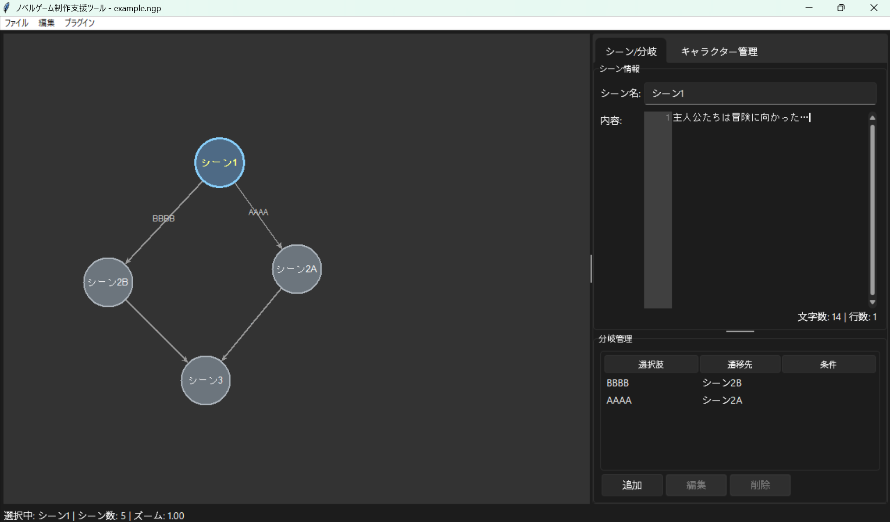

# ノベルゲーム制作支援ツール

**ノベルゲームの分岐シナリオを、図を描くように作れるツール。**

ストーリー分岐をノードグラフとして視覚的に設計・管理できる、ノベルゲーム開発者向けのデスクトップアプリケーションです。  
Ren'Py・ティラノスクリプトなど、あらゆるノベルゲームエンジンと組み合わせて使えます。

> A desktop tool for visually designing and managing story branches in novel games.  
> Works with any novel game engine (Ren'Py, TyranoScript, etc.)



---

## 特徴 / Features

- **ビジュアルノードエディタ** — ストーリーの分岐をノードグラフとして視覚的に把握・編集
- **シーン編集** — タイトルと本文をエディタで編集、文字数・行数をリアルタイム表示
- **分岐管理** — 選択肢テキスト・遷移先・条件を設定した分岐を追加・編集・削除
- **プラグインシステム** — 自動バックアップ・キャラクター管理など機能をプラグインで拡張可能
- **ダーク / ライトテーマ** — [sv-ttk](https://github.com/rdbende/Sun-Valley-ttk-theme) による洗練されたUI
- **カスタマイズ可能なショートカット** — 設定画面からキーバインドを自由に変更
- **最近使ったファイル** — 素早く前回のプロジェクトを開ける

---

## ダウンロード / Download

**Pythonを必要とせず、そのまま起動できる実行ファイル版を配布しています。**

👉 **[最新版 v1.5.0 をダウンロード](https://github.com/shouta0224/NovelGameProductionSupportTool/releases/latest)**

ZIPを解凍して `NovelGameProductionSupportTool.exe` を起動するだけで使えます。

---

## 動作環境 / Requirements

| | |
|---|---|
| OS | Windows 10 / 11 |
| Python（ソースから起動する場合） | 3.9 以上 |

---

## ソースから起動する場合 / Installation from source

```bash
# リポジトリをクローン
git clone https://github.com/shouta0224/NovelGameProductionSupportTool.git
cd NovelGameProductionSupportTool

# 依存ライブラリをインストール
pip install -r requirements.txt

# 起動
python NovelGameProductionSupportTool.py
```

---

## 使い方 / Usage

### 基本操作

| 操作 | 方法 |
|---|---|
| シーンを追加 | キャンバス上で右クリック →「ここにシーンを追加」 |
| シーンを選択 | ノードをクリック |
| シーンを移動 | ノードをドラッグ |
| 分岐を追加 | シーンを選択した状態で「分岐管理」パネルの「追加」ボタン |
| ズーム | `Ctrl` + マウスホイール |
| スクロール | マウスホイール（縦） / `Shift` + マウスホイール（横） |
| ビューをリセット | `Ctrl + 0` |

### ショートカット（デフォルト）

| アクション | キー |
|---|---|
| 新規プロジェクト | `Ctrl + N` |
| 開く | `Ctrl + O` |
| 保存 | `Ctrl + S` |
| 名前を付けて保存 | `Ctrl + Shift + S` |
| シーンを追加 | `Ctrl + A` |
| 分岐を追加 | `Ctrl + B` |
| ズームイン | `Ctrl + +` |
| ズームアウト | `Ctrl + -` |

ショートカットは「ファイル」→「設定」から変更できます。

### プロジェクトファイル

プロジェクトは `.ngp` 形式（JSON）で保存されます。テキストエディタで直接編集することも可能です。

---

## プラグイン / Plugins

`plugins/` フォルダに Python ファイルを配置することで機能を拡張できます。

### 同梱プラグイン

| プラグイン | 説明 |
|---|---|
| `auto_backup` | 指定間隔でプロジェクトを自動バックアップ（デフォルト: 5分） |
| `character_manager_2` | キャラクター（名前・説明・カラー・画像）を管理するタブを追加 |

プラグインの有効/無効は「プラグイン」メニュー → 「プラグイン管理」から切り替えられます（再起動が必要）。

### プラグインの作り方

`IPlugin` クラスを継承し、`setup()` / `register()` / `teardown()` を実装するだけです。

```python
from __main__ import IPlugin

class MyPlugin(IPlugin):
    def setup(self):
        pass  # 初期化処理

    def register(self):
        self.app.add_plugin_menu_command("My Feature", self.my_feature)

    def teardown(self):
        self.app.remove_plugin_menu_command("My Feature")

    def my_feature(self):
        print("Hello from my plugin!")
```

---

## ライセンス / License

[MIT License](LICENSE)

---

## バージョン / Version

**v1.5.0** — 2026/5/17
